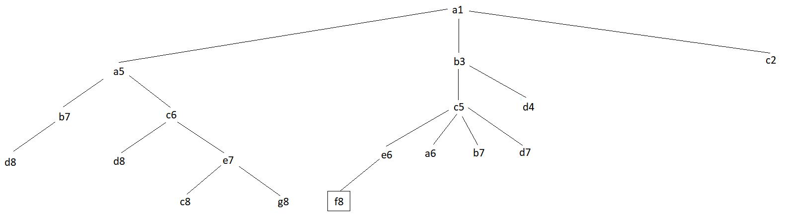
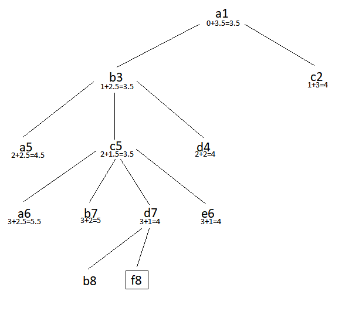

# Exame 2017

## 1

**a)**



**b)** Todas as estratégias são completas, pois vai sempre chegar a uma solução, uma vez que esta existe.

**c)**

* h1: não é aceitável, uma vez que sobrestima o custo. Por exemplo, se o cavalo estiver na posição d4 e quiser mover-se para f5, o custo segundo a heurística é 3 e na realidade o custo é 1.

* h2: não é aceitável, uma vez que sobrestima o custo. Por exemplo, se o cavalo estiver na posição d4 e quiser mover-se para f5, o custo segundo a heurística é 2 e na realidade o custo é 1.

* h3: é aceitável, uma vez que não sobrestima o custo real. Ao reduzir para metade o valor máximo entre a distância horizontal e vertical, e uma vez que o cavalo se move sempre duas casas na horizontal ou na verical em cada movimento, então o valor calculado pela heurística vai ser sempre inferior ou igual ao custo real, pois o cavalo ainda se vai ter de mover depois na vertical/ horizontal. Por exemplo, se o cavalo estiver na posição d4 e quiser mover-se para f8, o custo segundo a heurística é 2 e na realidade o custo é 2.

* h4: 

* h5: é admissível

A melhor heurística é a h3, uma vez que retorna valores mais próximos do custo real.

**d)**



## 2

**a)** Lista de tamanho 5, contendo em cada posição a cor associada à respetiva posição. Por exemplo, I1 ficaria: [B,V,B,A,V].

**b)** 

* Função de adaptação: 7 - numErradas (nº de fronteiras erradas - uma fronteira está errada quando os 2 países a ela adjacentes possuem a mesma cor).
* O objetivo é minimizar o custo, transformamos um problema de minimização em maximização, subtraindo pelo valor de custo máximo (7 é o número de fronteiras).

```
Custo1 = 7 - 2 = 5
Custo2 = 7 - 1 = 6
Custo3 = 7 - 3 = 4
Custo4 = 7 - 5 = 2
Custo5 = 7 - 2 = 5
```

**c)**

```
Total = 5 + 6 + 4 + 2 + 5 = 22

P(I2) = 6 / 22 = 0.272 -> [0, 0.272]
P(I1) = 5 / 22 = 0.227 -> ]0.272, 0.499]
P(I5) = 5 / 22 = 0.227 -> ]0.499, 0.726]
P(I3) = 4 / 22 = 0.182 -> ]0.726, 0.908]
P(I4) = 2 / 22 = 0.091 -> ]0.908, 1.0]

I2) [A,V,V,A,B] (Elitismo)
I1) (Random Value = 0.7) = [B,V,B,A,V]
I5) (Random Value = 0.35) = [B,B,V,B,V]
I3) (Random Value = 0.15) = [B,V,A,V,V]
I4) (Random Value = 0.81) = [B,B,B,B,V]
```

**d)**

Estratégia: Cruzar os indivíduos considerando como ponto de corte o valor central.

```
I2: mantém (elitismo)
I1: mantém (valor aleatório: 0.81 > 0.75)
I5: cruza (valor aleatório: 0.41 < 0.75)
I3: cruza (valor aleatório: 0.24 < 0.75)
I4: mantém (valor aleatório: 0.88 > 0.75)

I2: [A,V,V,A,B]
I1: [B,V,B,A,V]
I5: [B,B,V,A,B]
I3: [A,V,A,V,V]
I4: [B,B,B,B,V]
```

## 3

**a)** 

```
Barbatana e Corpo

E(S) = -4/8 * log2(4/8) - 4/8 * log2(4/8) = 1

------------------
Cauda

E(S) = -4/7 * log2(4/7) - 3/7 * log2(3/7) = 0.985
```

**b)**

```
Barbatana: 4F 4L

Split Info = -4/8 * log2(4/8) - 4/8 * log2(4/8) = 1
Gain Ratio = (1 - 0.811) / 1 = 0.189

-----------------
Cauda: 2G 5P

Split Info = -2/8 * log2(2/8) - 5/8 * log2(5/8) - 1/8 * log2(1/8) = 1.298
Gain Ratio = 7/8 * (0.985 - 0.6) / 1.298 = 0.259

-----------------
Corpo: 5G 3E

Split Info = -5/8 * log2(5/8) - 3/8 * log2(3/8) = 0.954
Gain Ratio = (1 - 0.95) / 0.954 = 0.052

O atributo que maximiza a razao do ganho é a Cauda.
```

## 4

**a)**

**c)** Caso o valor do novo estado seja superior ao valor do estado atual, então, neste caso, o estado atual passa a ser este novo estado, uma vez que é uma melhor solução do que a anterior. No caso do valor do novo estado ser inferior ao valor do atual, então a probabilidade desse estado ser aceite é `e^(delta/T), em que delta é a diferença entre o novo valor e o valor atual, e T é o valor da temperatura atual.

**d)** O número de nós examinados pode ser reduzido caso os nós estejam perfeitamente ordenados, permitindo fazer mais e melhores cortes nestes casos.