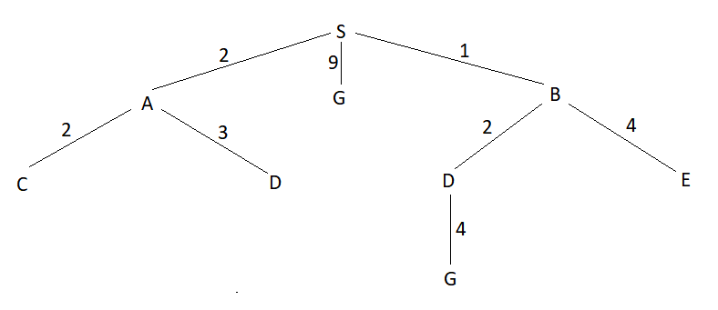
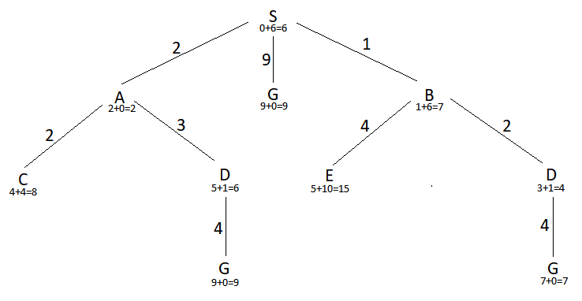

# Recurso 2017

## 1

**a)** S -> G

**b)** S, B, A, D



**c)** S -> B -> D -> G



**d)** A heurística é admissível, uma vez que nunca sobrestima os custos para se chegar à solução. 
No entanto, não é admissível, uma vez que em vários casos não se verifica que h(N) <= c(N,a,N')+h(N'). Por exemplo: 
* h(S) = 6 > 2 + h(A)
* h(B) = 6 > 2 + h(D)

# 3

**a)** 

Uma função de avaliação poderá ser a distância total percorrida para fazer o percurso.

Avaliação1 = 30 + 35 + 20 + 35 = 120

Uma possível função de vizinhança será trocar a ordem de visita de duas escolhidas de forma aleatória. Por exemplo, um possível vizinho seria A-C-B-D-A.

**b)** 

```
T = 50

novo_estado = A-C-B-D-A 
avaliação = 135
delta = 130-135 = -5
delta < 0:
    * radom_value=0.82
    * e^(-5/50) = 0.9
    * 0.9 > 0.82 => solução aceite => estado_atual = novo_estado


T = 40

novo_estado = A-D-C-B-A
avaliação = 120
delta = 135-120 = 15
delta > 0:
    * soluçao aceite => estado atual = novo_estado


T = 30

novo_estado = A-B-D-C-A
avaliação = 115
delta = 120-115 = 5
delta > 0:
    * soluçao aceite => estado atual = novo_estado


T = 20

novo_estado = A-D-B-C-A
avaliação = 135
delta = 115-135 = -20
delta < 0:
    * random_value = 0.6
    * e(-20/20) = 0.37
    * 0.37 < 0.6 => solução não é aceite
```

**c)** O objetivo da introdução da aleatoriedade é escapar aos ótimos locais em que por vezes as funções de otimização ficam presas. Ao aceitar-se soluções que não são tão boas como a atual, e aceitando-a com uma probabilidade que é inversa ao aumento do custo, é mais provável que o algoritmo acabe por convergir para ótimo global. Caso o grau de aleatoriedade seja nulo, então o algoritmo fica semelhante ao algoritmo greedy, uma vez que só vai aceitar melhorar a solução para um valor melhor, pelo que pode acabar por ficar preso num ótimo local, apresentando essa solução. Caso o grau de aleatoriedade seja infinito, então todas as soluções serão aceites, quer tenham um valor melhor ou pior.

# 4

**b)** Ou se escolhe sempre o estado próximo com menor valor estimado do custo para a solução (caso do algoritmo “Hill climbing”) ou, caso em que o próximo estado considerado tenha um maior custo para chegar à solução, a sua aceitação depende de uma probabilidade considerada para esse efeito (caso do  “Simulated  Annealing”).  Nos  AGs,  por  ex.,  também  se  geram  estados  seguintes  dependentes  de alguma aleatoriedade.

**d)** Raiz -> 5; Min -> <=5; Max -> 5


