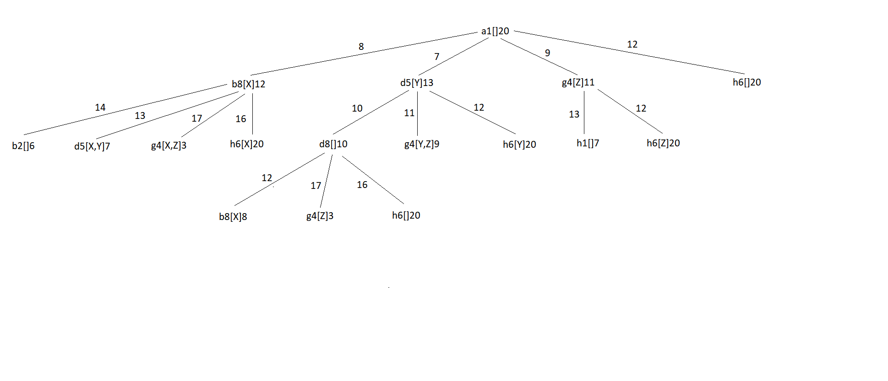

# Exame 2018

## 1

**a)** 

**b)**

* h1: é admissível uma vez que o robot necessita sempre de se deslocar pelo menos uma casa para cada objeto;
* h2: é admissível, uma vez que o robot necessita sempre de se deslocarpelo menos uma cada para cada objeto, mesmo para aqueles que já foram recolhidos e que estão com ele;
* h3: não é admissível, pois para entregar 2 objetos pode haver parte do caminho em comum. Por exemplo, para a situação  R[X,Y] _ _ Y X, o custo segundo h3 é 11, mas o custo real é 6, logo sobrestima.
* h4: é admissível, uma vez que vai subestimar o custo até ao último objeto, altura em que a estimativa será igual ao custo real.

**c)** h4, uma vez que os valores obtidos utilizando esta heurística serão mais próximos do custo real.

## 2

**a)** [M1,M3,M2,M3,M3]

**b)** A função pode ser o máximo de tempo gasto por uma máquina. Se um dos indivíduos usar 2 máquinas, o valor será o valor máximo de tempo gasto por uma das máquinas.

Indivíduo i:
    * M1 = 10 + 7 + 8 = 25
    * M2 = 11 + 12 = 23
    * Max(25,23) = 25

Indivíduo ii:
    * M1 = 10
    * M2 = 11
    * M3 = 7 + 12 + 8 = 27
    * Max(10,11,27) = 27

Indivíduo iii: 
    * M1 = 10 + 7 = 17
    * M2 = 11 + 12 + 8 = 31
    * Max(17,31) = 31

Indivíduo iv:
    * M1 = 7
    * M2 = 10 + 11 + 12 + 8 = 41
    * Max(7,41) = 41

**c)**  

Probabilidade de cada indivíduo ser selecionado:

```
Total = 25 + 27 + 31 + 41 = 124

P(i) = 25 / 124 = 0.202 -> [0, 0.202[
P(ii) = 27 / 124 = 0.218 -> ]0.202, 0.420]
P(iii) = 31 / 124 = 0.25 -> ]0.420, 0.670]
P(iv) = 41 / 124 = 0.330 -> ]0.670, 1.0]
```

Seleção dos resultados:

```
i) [M1, M1, M2, M2, M1] (Elitismo)
ii) (Random value = 0.22) [M1, M3, M2, M3, M3]
iii) (Random value = 0.4) [M1, M1, M2, M2, M2]
iv) (Random value = 0.88) [M2, M1, M2, M2, M2]
```

**d)**


## 4

**a)** Uma heurística admissível é aquela que nunca sobrestima o custo de chegar à solução. Já uma heurística consistente é uma que garanta que em cada nó n o custo estimado nunca é superior ao custo estimado a partir de um nó sucessor n’ mais o custo do passo de n para n’: h(n) ≤ c(n,a,n’) + h(n’).
Sim, uma heurística admissível não é necessariamente consistente.

**c)** 

P(X) = e^(delta/T) = e^(0.8/-3) = 0.0235
delta = 12 - 15 = -3
T = 0.8

**f)** Baseia-se em regras de diagnóstico, uma vez que parte de efeitos observados em direção às causas desses efeitos.