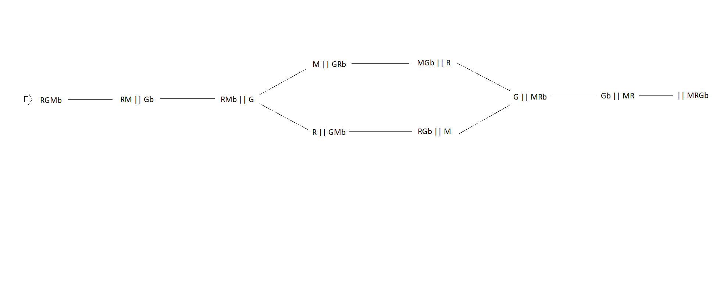
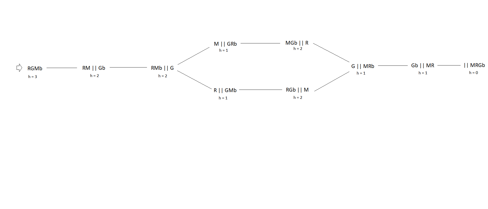
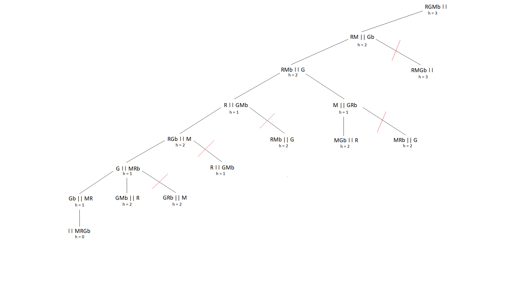
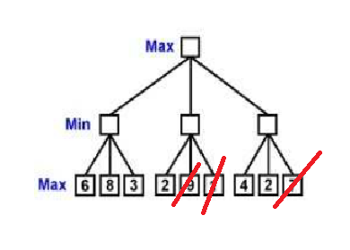

# Recurso 2018

## 1 

**a)** 

**b)** Uma possível heurística poderá ser o número de elemntos que estão do lado esquerdo. É sempre admissível, uma vez que irá haver pelo menos um movimento para colocar esse elemento no sítio correto.



**c)** 

## 2 

**a)** 

Custo S1:
* M1 = 10 + 7 + 8 = 25
* M2 = 11 + 12 = 23
* Max(23, 25) = 25

Custo = 25

**b)** 

* S2 = {A-M2, B-M1, C-M2, D-M2, E-M1}
* S3 = {A-M1, B-M3, C-M2, D-M2, E-M1}
* S4 = {A-M1, B-M1, C-M3, D-M2, E-M1}
* S5 = {A-M1, B-M1, C-M2, D-M3, E-M1}
* S6 = {A-M1, B-M1, C-M2, D-M2, E-M2}
* S7 = {A-M1, B-M1, C-M2, D-M2, E-M3}

* Custo S2 = Max(15,33) = 33
* Custo S3 = Max(18,23,7) = 23
* Custo S4 = Max(25,12,11) = 25
* Custo S5 = Max(25,11,12) = 25
* Custo S6 = Max(17,31) = 31
* Custo S7 = Max(17,23,8) = 23

Será escolhido o S3 ou o S7.

**c)** 

```
P(S2) = e^(delta/T) = e^(-8/10) = 0.449
delta = 25 - 33 = -8
T = 10
```

Como 0.449 < 0.55, então a S2 é rejeitada.

Como S3 < S1, então a solução S3 é aceite.

## 4 

**a)** Utilizava-se a pesquisa em profundidade com profundidade limitada, uma vez que permite obter uma solução a uma profundidade inferior ao limite dado, cujo valor máximo é sabido. Este algoritmo não garante que retorna sempre a melhor solução, mas este não é um dos requesitos. Em termos de gastos com memória, estes também são reduzidos, uma vez que não precisa de guardar os nós em memória, o que é importante devido à grande ramificação da árvore.

**b)** h' = h/1.1 = 0.999*h

**d)**

```
Total = 10 + 15 + 27 + 30 = 82
P(C1) = 10 / 82 = 0.122
P(C2) = 15 / 82 = 0.183
P(C3) = 27 / 82 = 0.329
P(C4) = 30 / 82 = 0.366
```

**e)**


