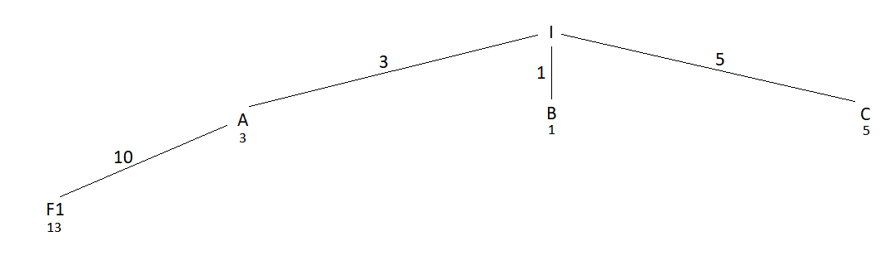
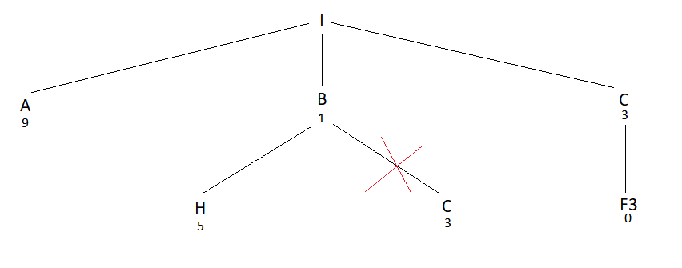
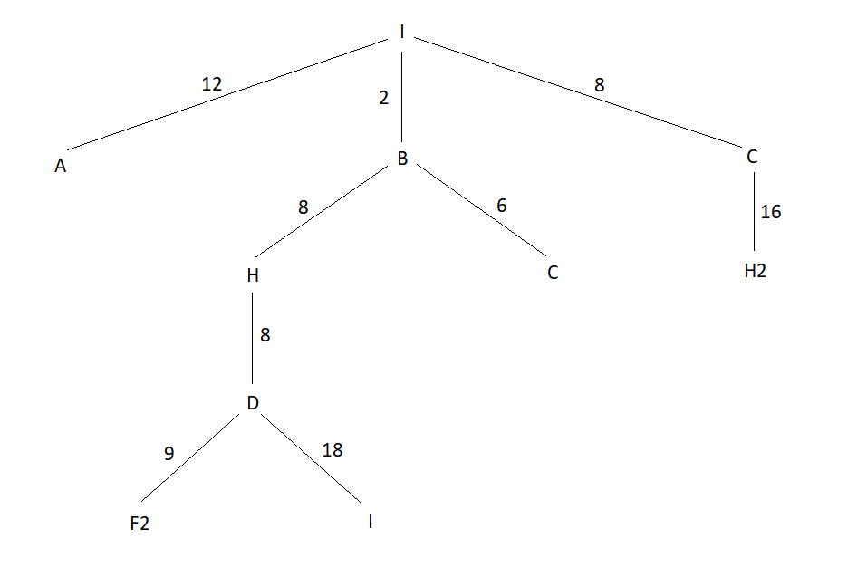
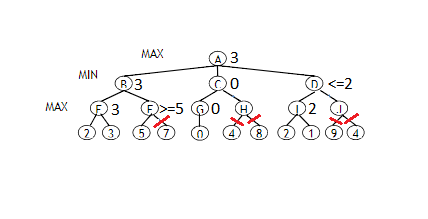

# Recurso2 2018

## 1 

**a)** 

**i)** I - A - F1

**ii)** I - C - F3

**iii)** I - B - H - D - F2

**b)** Sim, a heurística é admissível, pois o valor desta é sempre inferior ao custo real da solução em todos os nós da árvore.

**c)** 

## 2

**a)** O indivíduo pode ser representado através de uma lista com tamanho 5, em que em cada posição se encontra a espécie que está plantada na zona com esse índice. Por exemplo, no caso de i) ficaria: [E, P, E, C, E].

**b)**

* Função de adaptação: 700 - soma dos custos de plantação em cada zona - penalização
* Penalização = 100 * n_iguais (n_iguais é o nº de zonas adjacentes com a mesma espécie plantada)
* O objetivo é minimizar o custo, transformamos um problema de minimização em maximização, subtraindo pelo valor de custo máximo (700 = 70 hectares * 10)

Custo1 = 700 - 8*20 - 9*10 - 8*10 - 10*20 - 8*10 = 90
Custo2 = 700 - 8*20 - 9*10 - 8*10 - 9*20 - 8*10 = 110
Custo3 = 700 - 9*20 - 8*10 - 10*10 - 8*20 - 10*10 = 80
Custo4 = 700 - 10*20 - 9*10 - 8*10 - 9*20 - 8*10 = 70

**c)**

Total = 90 + 110 + 80 + 70 = 350

P(i) = 90 / 350 = 0.257 -> [0, 0.257]
P(ii) = 110 / 350 = 0.314 -> ]0.257, 0.571]
P(iii) = 80 / 350 = 0.229 -> ]0.571, 0.8]
P(iv) = 70 / 350 = 0.2 -> ]0.8, 1.0]

i) [E,P,E,C,E] (Elitismo)
ii) (Random value = 0.65) = [E,P,E,P,E]
iii) (Random value = 0.8) = [P,E,C,E,C]
iv) (Random value = 0.21) = [C,P,E,P,E]

Seleciona o indivíduo i, pois tem um valor maior.

**d)** 

## 4  

**a)** A afirmação é falsa. Se uma árvore tiver várias soluções, então as soluções poderão ser diferentes.

**b)** O arrefecimento simulado pode escolher, como estado seguinte, um estado sucessor que pode ter uma avaliação inferior ao estado atual. Tal deve-se ao facto de a escolha ser probabilística, decrescendo essa probabilidade com o tempo. No ínicio, a probabilidade de escolher estados mais afastados é mais elevada.

**c)** 

