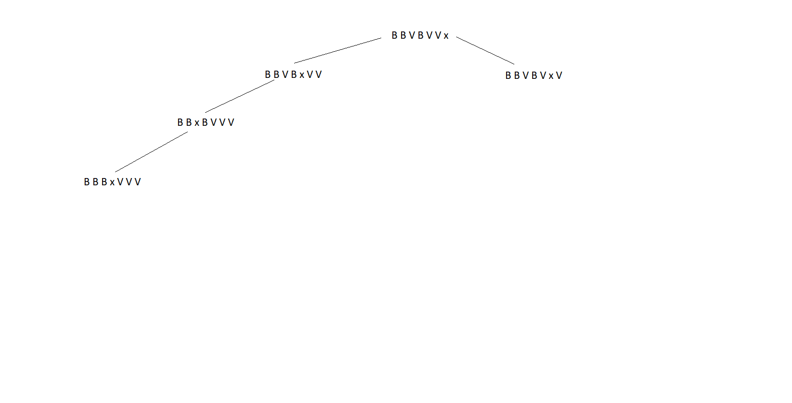
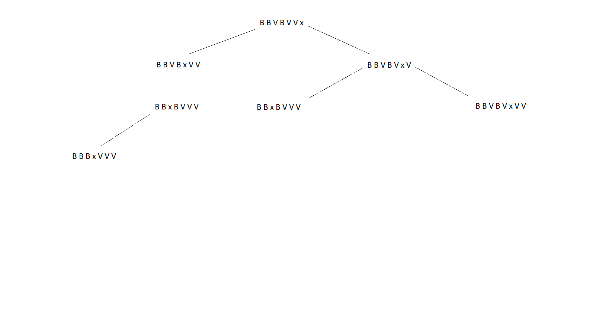

# Exame 2019

## 1

**1.**

* Representação do estado: Lista com 7 entradas, cada uma representando uma das 7 casas do tabuleiro. O 0 representa o espaço vazio, o -1 representa as peças vermelhas e o 1 representa as peças brancas.

* Estado inicial: [-1, -1, -1, 0, 1, 1, 1]

* Estado final: [1, 1, 1, 0, -1, -1, -1]

* Operadores: 
  * M1R: 
    * Pré-condições - é aplicado a uma peça vermelha, a casa à direita tem de estar vazia e o seu índice deve ser inferior a 7, para que se possa mover para a direita;
    * Efeitos - o valor de M[i] passa a ser 0 e o valor de M[i+1] fica -1;
    * Custo - 1;
  
  * M1W: 
    * Pré-condições - é aplicado a uma peça branca, a casa à esquerda tem de estar vazia e o seu índice deve ser superior a 0, para que se possa mover para a esquerda;
    * Efeitos - o valor de M[i] passa a ser 0 e o valor de M[i-1] fica 1;
    * Custo - 1;
  
  * M2R: 
    * Pré-condições - é aplicado a uma peça vermelha, a casa com índice i+2 tem de estar vazia e i tem de ser inferior a 6, para que a peça possa saltar sobre uma peça para uma casa livre;
    * Efeitos - o valor de M[i] passa a ser 0 e o valor de M[i+2] fica a -1;
    * Custo - 2;
  
  * M2W:
    * Pré-condições - é aplicado a uma peça branca, a casa com índice i-2 tem de estar vazia e i tem de ser superior a 1, para que a peça possa saltar sobre uma peça para uma casa livre;
    * Efeitos - o valor de M[i] passa a ser 0 e o valor de M[i-2] fica a 1;
    * Custp - 2;
  
  * M3R: 
    * Pré-condições - é aplicado a uma peça vermelha, a casa com índice i+3 tem de estar vazia e i tem de ser inferior a 5, para que a peça possa saltar sobre duas peças para uma casa livre;
    * Efeitos - o valor de M[i] passa a ser 0 e o valor de M[i+3] fica a -1;
    * Custo - 2;
  
  * M3W:
    * Pré-vcodições - é aplicado a uma peça branca, a casa com índice i-3 tem de estar vazia e i tem de ser superior a 2, para que a peça possa saltar sobre duas peças para uma casa livre;
    * Efeitos - o valor de M[i] passa a ser 0 e o valor de M[i-3] fia a 1;
    * Custo - 2;
  
Custo: a função de custo, a qual se quer minimizar, tem valor igual à soma do custo de todos os movimentos efetuados para chegar ao estado objetivo.

**2.** 

* h1 é sempre admissível, uma vez que nunca sobrestima o valor da solução ótima;
* h2 não é admissível, uma vez que, por exemplo, no estado [1,1,1,-1,0,-1,-1], o custo para atingir a solução é apenas 1 e o custo retornado pela heurística é 5, logo sobrestimado;
* h3 é admissível, uma vez que nunca vai sobrestimar o custo para atingir a solução ótima. Por exemplo, no estado inicial [-1,-1,-1,0,1,1,1], o custo retornado pela heurística é 6 e na realidade o custo para atingir a solução vai ser superior a 6. No caso [1,1,1,-1,0,-1,-1], a heurística retorna 0 e o custo real para atingir a solução é 1. Logo, não sobrestima os custos.

**3.** Como o custo de um movimento nuca vai ser superior à distância percorrida pela peça nesse movimento, uma boa heurística seria contar o número mínimo de espaços que cada peça tem de se mover para atingir a posição correta. Para isto, podemos recorrer ao seguinte código:

```py
def heuristic(state):
    h = 0;
    for i in range(7):
        if(state[i] == -1):
            h += max(0, 4-i)
        else: 
            if(state[i] == 1):
                h += (0, i-2)
    return h
```

**4.** 

**a)** 

**b)** 

## 2

**1.** 

* Representação das posições dos clientes e das fábricas: (x,y);
* Função de avaliação: distância de Manhattan entre os 2 pontos;
* Representação da solução: [2,4,3,1,5,6], em que cada elemento da lista representa o cliente a ser visitado e o índice da posição representa a posição em que o cliente é visitado.

```py
def evaluate(sol):
    score = 0
    for i in range(1, len(sol)):
        score += manhattan(sol[i-1], sol[i])
    score += manhattan(fab1, sol[0])
    score += manhattan(sol[len(sol)-1], fab2)
    return score;
```

**2.** Uma possível função de vizinhança será trocar a posição de 2 clientes da lista;

```py
def neighbor(sol):
    new_sol = sol
    first, second = random(0, len(sol)), random(0, len(sol))
    while(first == second):
        first, second = random(0, len(sol)), random(0, len(sol))
    new_sol[first] = sol[second]
    new_sol[second] = sol[first] 
    return new_sol
```

**3.**

```py
def hill_climbing(fab, cli):
    state = []
    for i in range(0, 6):
        randomNum = []
        while True:
            randomNum = round(random()*5)
            if state.includes(randomNum):
                continue
            state.push(randomNum)
            break
    
    for i in range(0, 100):
        new = new_random_state(state)
        if eval(new, fab, cli) < eval(state, fab, cli):
            state = new
            i = 0
```

# 3

**3.1** Sim, porque o jogo do galo é um problema com um espaço de estados reduzido. Por isso, um agente simples reflexo seria uma forma rápida de resolver o problema.
De forma a implementar este problema teria numa estrutura de dados a melhor jogada a partir do estado atual. O estado atual seria constituído pelas posições das peças no tabuleiro e também a peça que identifica o agente (X ou O).

**3.2** O algoritmo de pesquisa uniforme é completo e garante sempre uma solução ótima. O algoritmo A*, quando utilizado com uma heurística admissível, também garante que encontra uma solução ótima e é também completo. Como todas as soluções têm custos diferentes, então existe apenas uma solução ótima. Desta forma, ambos os algoritmos vão atingir a solução ótima.

**3.3** 

**a)** C. A pesquisa em largura expande todos os nós de cada nível antes de avançar para o nível seguinte. Como o último nó a ser expandido foi o B, então o próximo a ser expandido é o C pois encontra-se no mesmo nível que B.

**b)** E. A pesquisa em profundidade explora sempre primeiro em profundidade o nó mais à esquerda antes de avançar para os seguintes que se encontrem no mesmo nível. Assumindo que o último nó expandido foi o B, então o próximo será o filho mais à esquerda deste, que é o E.

**c)** D. A pesquisa uniforme expande sempre primeiro os nós com menor valor de g.

**d)** C. A pesquisa gulosa expande primeiro os nós com menor valor da heurística h.

**e)** G. A pesquisa A* explora sempre primeiro os nós com menor valor de f = g + h. No caso do nó G, o valor de f é 10.

**3.4** Na aplicação do algorítmo minimax com alfa-beta prunning, a ordenação dos nós tem um forte impacto no número de cortes executados pelo algorítmo alfa-beta.  
Seja b o fator de ramificação médio da árvore e d a sua profundidade: 
Se a ordenação dos nós estiver na pior forma possível, não vai ser possível realizar quaisquer cortes alfa beta, sendo necessário visitar todos os nós da árvore (visitar b^d nós). 
No entanto, se a ordenação dos nós gerados for feita na sua forma ótima, isto é, na forma em que o número de cortes alfa-beta é maximo, o número de nós visitados será muito menor, sendo apenas necessário visitar b^(d/2) nós, isto é, apenas cerca de metade da profundidade. 
Se a ordenação for feita de forma aleatória, o número de nós visitados poderá ser menor do que no pior caso.

**3.5**

**a)** 

* A -> 8
* B -> 3
* C -> <=1
* D -> 8


**b)** O, Q, T, U, Y

**3.6**

**a)** Tratando-se de um problema de maximização, e como o novo valor é inferior ao valor atual, então a probabilidade de ser aceite é e^(delta(E)/T). delta(E) = 18-20 = -2. P = e^(-2/0.9) = 0,1084 = 10,84%.

**b)** Tratando-se de um problema de minimização, e como o novo valor é inferior ao valor atual, então este é aceite, passando o estado atual a ser este.
