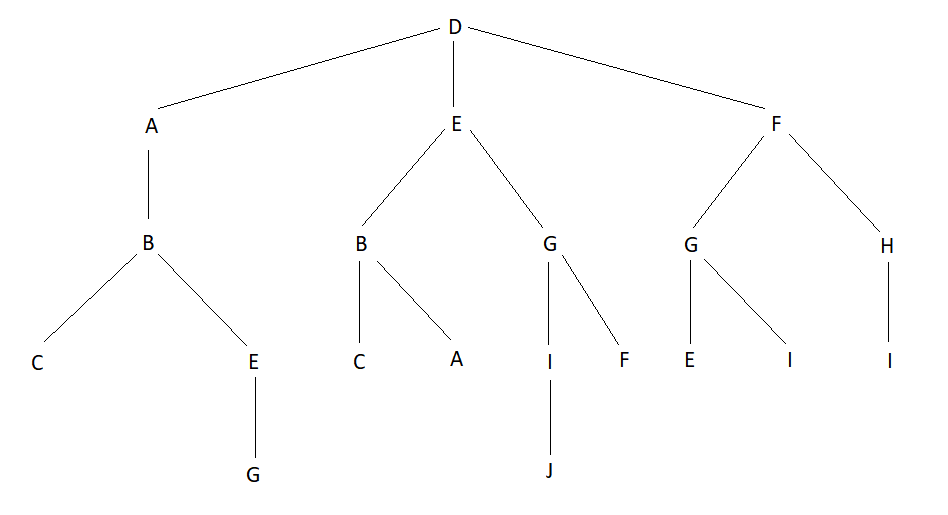
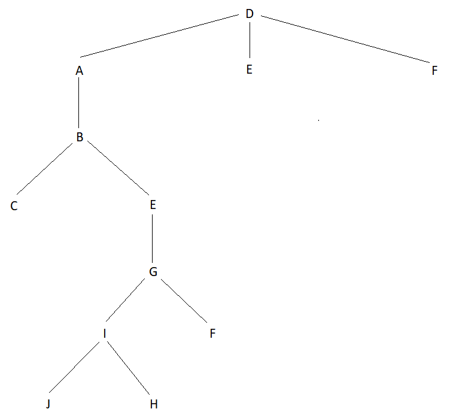

# Recurso 2019

## 1

**1.**

* Representação do estado: 
  * (Origem, Atual, Destino, Matrix)
  * Origem é o par (x,y) que corresponde às coordenadas do nó origem;
  * Atual é o par (x,y) que corresponde às coordenadas do nó atual;
  * Destino é o par (x,y) que corresponde às coordenadas do nó destino;
  * Matrix correspondea uma lista de listas (array com 4 listas, cada uma com 3 elementos), preenchidas em cada posição por uma letra de 'A' a 'J' ou então com um '-' no caso de ser uma parede.

* Estado inicial: D(1,3), D(1,3), J(3,4), [[A,B,C],[D,E,-],[F,G,-],[H,I,J]]

* Estado final: D(1,3), J(3,4), J(3,4), [[A,B,C],[D,E,-],[F,G,-],[H,I,J]]

* Operadores: 
  * Up
    * Pré-condições:
      * Atual = M[Y][X]
      * Y > 1
      * M[Y-1][X] != - 
    * Efeitos: 
      * Atual = Matrix[Y-1][X]
    * Custo = 1
  
  * Rigth
    * Pré-condições:
      * Atual = M[Y][X]
      * X < 3
      * M[Y][X+1] != - 
    * Efeitos: 
      * Atual = Matrix[Y][X+1]
    * Custo = 1

  * Down
    * Pré-condições:
      * Atual = M[Y][X]
      * Y < 3
      * M[Y+1][X] != - 
    * Efeitos: 
      * Atual = Matrix[Y+1][X]
    * Custo = 1
  
  * Left
    * Pré-condições:
      * Atual = M[Y][X]
      * X > 1
      * M[Y][X-1] != - 
    * Efeitos: 
      * Atual = Matrix[Y][X-1]
    * Custo = 1

**2.**

**i)**

**ii)**

**3.**