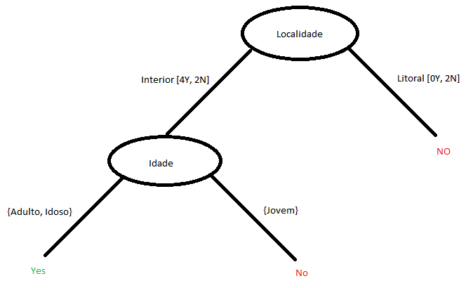
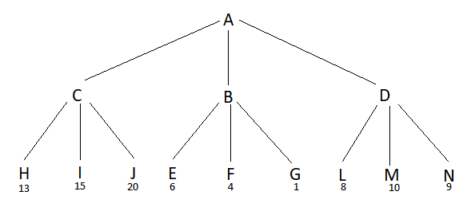

# Recurso 2019

## 1

**1.**

* Representação do estado: 
  * (Origem, Atual, Destino, Matrix)
  * Origem é o par (x,y) que corresponde às coordenadas do nó origem;
  * Atual é o par (x,y) que corresponde às coordenadas do nó atual;
  * Destino é o par (x,y) que corresponde às coordenadas do nó destino;
  * Matrix correspondea uma lista de listas (array com 4 listas, cada uma com 3 elementos), preenchidas em cada posição por uma letra de 'A' a 'J' ou então com um '-' no caso de ser uma parede.

* Estado inicial: D(1,3), D(1,3), J(3,4), [[A,B,C],[D,E,-],[F,G,-],[H,I,J]]

* Estado final: D(1,3), J(3,4), J(3,4), [[A,B,C],[D,E,-],[F,G,-],[H,I,J]]

* Operadores: 
  * Up
    * Pré-condições:
      * Atual = M[Y][X]
      * Y > 1
      * M[Y-1][X] != - 
    * Efeitos: 
      * Atual = Matrix[Y-1][X]
    * Custo = 1
  
  * Rigth
    * Pré-condições:
      * Atual = M[Y][X]
      * X < 3
      * M[Y][X+1] != - 
    * Efeitos: 
      * Atual = Matrix[Y][X+1]
    * Custo = 1

  * Down
    * Pré-condições:
      * Atual = M[Y][X]
      * Y < 3
      * M[Y+1][X] != - 
    * Efeitos: 
      * Atual = Matrix[Y+1][X]
    * Custo = 1
  
  * Left
    * Pré-condições:
      * Atual = M[Y][X]
      * X > 1
      * M[Y][X-1] != - 
    * Efeitos: 
      * Atual = Matrix[Y][X-1]
    * Custo = 1

**2.**

**i)**


**ii)**


**3.**

**iii)** A pesquisa gulosa expande sempre o nó com menor avaliação. Assim, neste caso, vai começar por expandir primeiro para os nós que se encontrem à direita. Caso não seja possível, então irá expandir para cima e, posteriormente, para baixo. No final, expande os nós com menor avaliação, ou seja, os que se encontram à esquerda. A prioridade é definida, primeiramente, pelo nó com menor avaliação e, depois, pelo nó mais à esquerda. 

**iv)** Este método gera todos os sucessores possíveis para o nó e depois escolhe aquele que se encontra melhor avaliado. Desta forma, irá funcionar tal como a pesquisa gulosa, pelo que a ordem pela qual os nós serão expandidos será a mesma.

**v)** A pesquisa gulosa expande sempre o nó com menor avaliação. Assim, neste caso, vai começar por expandir primeiro para a direita e depois para baixo. No final, expande os nós com menor avaliação, começando pelos de cima e passando a seguir para os da esquerda.

**vi)** Este método gera todos os sucessores possíveis para o nó e depois escolhe aquele que se encontra melhor avaliado. Desta forma, irá funcionar tal como a pesquisa gulosa, pelo que a ordem pela qual os nós serão expandidos será a mesma. 

**4.** Este algoritmo está mais próximo de efetuar uma pesquisa em largura, uma vez que expande um nó de cada vez, adicionando os filhos deste a uma lista, que contém, de forma ordenada, todos os nós filhos do nó inicial (exceto aqueles que já foram expandidos) e os netos do nó incial. Assim, este algoritmo vai expandir sequencialmente cada um dos nós da lista até encontrar a solução, expandindo primeiro todos os filhos e depois os netos do nó inicial.

Para tornanr este algoritmo num algoritmo de pesquisa em profundidade, seria necessário expandir primeiro todos os filhos de um nó antes de expandir os irmãos desse nó. Para isso, seria necessário chamar recursivamente o algoritmo para todos os filhos do nó, começando pelos que estão mais esquerda. Para além disso, seria necessário verificar se a profundidade do nó a ser expandido ainda não ultrapassou a profundidade limite.

**5.** 

## 2

**1.** E(S) = -0.5 * log2(0.5) - 0.5 * log2(0.5) = 1

**2.**

```
Localidade: 6I 2L

Split Info = -6/8 * log2(6/8) - 2/8 * log2(2/8) = 0.811
Gain Ratio = (1 - 0.688) / 0.811 = 0.385

-----------------------
Sexo: 4M 4F

Split Info = -4/8 * log2(4/8) - 4/8 * log2(4/8) = 1
Gain Ratio = (1 - 0.951) / 1 = 0.049

-----------------------
Idade: 2J 2A 4I

Split Info = -2/8 * log2(2/8) - 2/8 * log2(2/8) - 4/8 * log2(4/8) = 1.5
Gain Ratio = (1 - 0.655) / 1.5 = 0.230

O critério escolhido para raiz da árvore é a Localidade.
```

**3.**



**4.**

```
Location -> Interior: (2 + 1) / (6 + 2) = 0.375
Location -> Litoral: (0 + 1) / (2 + 2) = 0.25
```
## 3

**1.**

Limite de profundidade 1

* 1

Limite de profundidade 2

* 1
* 2

Limite de profundidade 3

* 1
* 2
* 3

Limite de profundidade 4

* 1
* 2
* 3
* 1 4

**2.** Tendo em conta que todas as heurísticas são admissíveis, ou seja, nenhuma delas sobrestima o custo real para atingir a solução a partir de cada nó, então é preferível utilizar a heurística C, uma vez que uma heurística será tanto melhor quanto melhor estimar o custo para atingir a solução. Desta forma, será necessário expandir menos nós e chega-se mais rapidamente à solução. 

**3.** A afirmação é verdadeira. A pesquisa subir a colina expande todos os nós e depois escolhe aquele que tem menor valor. No caso da pesquisa gulosa, esta também expande todos os nós e depois vai escolher aquele que apresentar menor valor. Como ambos os algoritmos utilizam a mesma heurística, então os valores para cada nó serão iguais para ambos os algoritmos, pelo que vão expandir exatamente o mesmo conjunto de nós.

**4.** No algoritmo "arrefecimento dissimulado", qualquer hipótese mais afastada da solução pode ser aceite com uma probabilidade igual a e^(delta/T), em que delta é a diferença entre a avaliação das duas hipóteses e T é a temperatura atual. Como a temperatura decresce constantemente à medida que os estados vão sendo avaliados, e uma vez que a probabilidade depende diretamente do valor da temperatura, então, quanto menor for a temperatura, menor será a probabilidade de uma estado mais afastado da solução ser aceite.

**5.** O indivíduo pode ser representado através de uma lista de tamanho 4, em que para cada posição contém o valor do X para o índice respetivo.
Para determinar a população inicial, poderia-se escolher aleatoriamente valores compreendidos entre 0 e 15 para cada Xi ou então utilizar uma função heurística para escolher os valores.
Para fazer o cruzamento, poderia-se selecionar os 2 primeiros valores de X do primeiro indivíduo e os 2 últimos valores de X do segundo indivíduo.
Para fazer a mutação, poderia-se selecionar aleatoriamente um dos valores de X e trocá-lo por um outro valor aleatório entre 0 e 15.

**6.** 

B -> 1
C -> 13
D -> <=8
A -> 13

Não são analisados os nós M e N.

**7.**



Neste caso, após calcular os nós H, I e J, o nó C fica com o valor 13 e, por isso, ao calcular o nó E, o nó B pode ser cortado e, por isso, evita-se o cálculo dos nós F e G. O mesmo acontece no nó D, evitando os nós M e N.

Num caso genérico, o necessário é posicionar o nó que vai ser escolhido no lado esquerdo da árvore, para ser avaliado primeiro e, nos restantes nós, meter o nó com o filho que vai criar um corte no ínicio da árvore. No caso de uma maximização mete-se o filho com o menor valor e no caso de uma minimização mete-se o filho como maior valor.