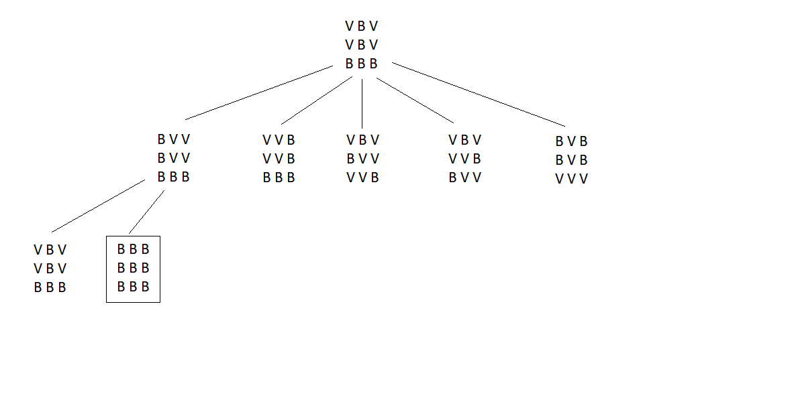

# Exame 2020

## 1.

**1.** 

* Representação do estado: Lista de listas, de tamanho 3x3, em que o 0 representa as peças brancas e o 1 representa as peças vermelhas. Ex: [[1,0,1], [1,0,1], [0,0,0]].

* Estado inicial: [[1,0,1], [1,0,1], [0,0,0]]

* Estado objetivo: [[0,0,0], [0,0,0], [0,0,0]]

* Operadores (nenhum tem pré-condições): 
  * ALL - inverte as cores de todas as peças da matriz;
  * TL - inverte as cores das 4 peças do canto superior esquerdo;
  * TR - inverte as cores das 4 peças do canto superior direito;
  * BL - inverte as cores das 4 peças do canto inferior esquerdo;
  * BR - inverte as cores das 4 peças do canto inferior direito; 

* Custo: ALL tem um custo de 9; Todas as outras têm custo 4; A função de custo é igual ao número de peças que são invertidas;

**2.** Cada nó da árvore dá origem a 5 novas ramificações, pois há 5 operadores possíveis. Assim, o fator de ramificação médio é 5.
Cada tabuleiro tem 9 peças, e cada uma pode estar em 2 estados diferentes (0 ou 1). Assim, a dimensão do espaço de estados é 2^9 = 512.

**3.** 

**4.** h(n) =  número de peças vermelhas existentes no tabuleiro. É admissível pois nunca vais sobrestimar o custo para chegar à solução, pois necessitamos de inverter as peças vermelhas para atingir a solução.

```py
def h(state):
    cnt = 0;
    for line in state:
        for col in line:
            if(col == 1):
                cnt++
    return cnt;
```

## 2

**1.** Na primeira linha, encontra-se o número de estabelecimentos e nas seguintes (uma por cada estabelecimento) aparecem as coordenadas de cada um deles, no formato "x y".

Ex:

7
1 10
5 4
20 2
12 4
2 8
10 5
6 1

Uma possível representação da solução seria uma lista contendo 3 listas no seu interior: uma contendo os estabelecimentos visitados pela primeira brigada, outra com os estabelecimentos visitados pela segunda brigada e outra com os estabelecimentos que não são visitados.

**2.** Como restrição forte temos o facto de a soma total dos tempos de inspeção e de deslocação de um dia não pode ultrapassar as 8 horas. Como critério de otimização temos a maximização do número de estabelecimentos visitados.
Como função de avaliação basta contar o número de estabelecimentos visitados, tendo também em conta as horas demoradas.

```py
def evaluate(sol):
    cont = 0
    time = 0
    for i in range(0, 2):
        for location in range(1, len(sol[i])):
            cont += 5
            time += manhattanh_dist(sol[i][location - 1], sol[i][location]) + 1

    return 0 if time > 8 else time + cont
```

**3.** 

Brigada 1: 1/20 * (40 + 20 + 10 + 10) + 3 * 1 = 4 + 3 = 7 horas

Brigada 2: 1/20 * (30 + 20 + 30) + 2 * 1 = 4 + 2 = 6 horas

A solução é viável uma vez que o tempo total de cada brigada não ultrapassa as 8 horas.

**4.** 

Uma função de vizinhança simples poderia ser:

* Escolher um número aleatório entre 0 e 2, para escolher se vamos remover um elemento, adicionar um elemento ou trocar um elemento entre brigadas
    * Se remover, escolher uma brigada aleatória e um elemento aleatório da brigada a remover, apagar esse elemento e adiciona-lo na lista de não visitados;
    * Se adicionar, escolher um elemento aleatório da lista de não visitados, apagar o elemento, escolher uma brigada a adicionar e uma posição aleatória para o colocar e coloca-lo na posição escolhida;
    * Se trocar, escolher um elemento aleatório de cada brigada e trocá-los.
  
Por exemplo: Solução: `[[ABC], [DE], []]`

Possíveis vizinhos (2.1):

* `[[BC], [DE], [A]]`
* `[[AC], [DE], [B]]`
* `[[AB], [DE], [C]]`
* `[[ABC], [E], [D]]`
+ `[[ABC], [D], [E]]`

Possíveis vizinhos (2.3):

* `[[DBC], [AE], []]`
* `[[EBC], [DA], []]`
* `[[ADC], [BE], []]`
* `[[AEC], [DB], []]`
* `[[ABD], [CE], []]`
* `[[ABE], [DC], []]`

## 3

**9.**

* Medida de desempenho: Aterragem segura, não brusca, confortável para os passageiros
* Ambiente: Via aérea (pássaros, outros aviões) e pista de aterragem (pessoas, veículos, outros aviões)
Atuadores: Mecanismos de controlo do avião, controlo do rol e pitch, controlo da potência dos motores, controlo do trem de atterisagem, etc.
Sensores: Sensor de altura, inclinação, pressão, velocímetro, GPS, giroscópio, etc.
O ambiente é dinâmico, inacessível, não determinístico e contínuo.
O mundo real é bastante complexo para um agente reativo simples, especialmente quando envolve uma tarefa complexa e crítica (vida dos passageiros) que não pode ser resolvida simplesmente com ligação direta entre o valor dos sensores para as ações. Por isso não é possível usar um agente reativo simples.

**10.**

**a)** 

* A -> 10;
* B -> 2;
* C -> 10;
* D -> <=5;

**b)** O, U, X, Y

**11.** O algoritmo minimax (usando cortes alfa-beta) e com profundidade limitada pode ser utilizado para jogos complexos.
Como o algoritmo analisa as jogadas possíveis, primeiro em profundidade, encontra uma primeira solução muito rápida (ao chegar à profundidade limite). Para retornar uma solução ao fim de um tempo limite basta interromper a pesquisa e verificar qual a melhor solução até esse momento retornando-a. Claro que esta solução rápida será imperfeita o que pode ser melhorado com uma boa ordenação dos nós na expansão (colocando primeiro as jogadas
mais prometedoras).

**12.**

```py
def simulated_annealing():
    current = initial_solution()

    for i in range(1500):
        if(i > 1000):
            T = 0
        else: 
            T = 1 - i/1000
        next = randomNeighbor(current)
        delta = evaluate(next) - evaluate(current)
        if(delta < 0 || e**(diff / T) > random(0,1)):
            current = next
```

**13.** O Mundo de Wumpus não pode ser resolvido por um agente puramente reativo, pois o ambiente do mindo de Wumpus não é totalmente acessível e precisa de ser explorado. É preciso que o agente se lembre de estados anteriores, onde é que o "stench" e "breeze" estiveram, etc. Por isso, um agente reativo simples, embora, com sorte, possa resolver algumas instâncias do problema, não pode com segurança resolver o mundo do Wumpus.

**14.**

```
1NN - Mesma classe que o vizinho mais próximo

* Ind14 (1, 1, 3) -> NN = (1, 1, 1) -> Classe C
* Ind15 (2, 4, 6) -> NN = (1, 3, 6) -> Classe B
* Ind16 (5, 9, 9) -> NN = (4, 9, 8) -> Classe A

3NN - Média pesada dos 3 vizinhos mais próximos (multiplicada por 1/d^2)

* Ind14 (1, 1, 3)
    * Ind13 (1, 1, 1), Classe = C, d^2 = 4
    * Ind3 (2, 2, 5), Classe = B, d^2 = 6
    * Ind8 (1, 3, 5), Classe = B, d^2 = 8

    C -> 1/4
    B -> 1/6 + 1/8 = 7/24
    B > C -> Classe = B

* Ind15 (2, 4, 6)
    * Ind4 (1, 3, 6), Classe = B, d^2 = 2
    * Ind3 (2, 2, 5), Classe = B, d^2 = 5
    * Ind8 (1, 3, 5), Classe = B, d^2 = 3

    Classe = B

* Ind16(5, 9, 9)
    * Ind9 (4, 9, 8), Classe = A, d^2 = 2
    * Ind2 (4, 7, 8), Classe = A, d^2 = 6
    * Ind1 (3, 8, 9), Classe = A, d^2 = 5

    Classe = A

```

**15.**

```py
import pandas as pd
import sklearn as sk
from sklearn.model_selection import train_test_split
from sklearn import neighbors
from sklearn.svm import SVC

data = pd.read_csv("data.csv")

X, y = data[['dimensao', 'localizacao', 'ano_construcao', 'tipo_acabamentos']], data['tipo_para_venda']

X_train, X_test, y_train, y_test = train_test_split(X, y, 0.2)

knn = neighbors.KNeighborsClassifier()
knn.fit(X_train, y_train)
knn_prediction = knn.predict(X_test)
knn_classification_report = classification_report(y_test, knn_prediction)
print(knn_classification_report)

svc = SVC() 
svc.fit(X_train, y_train)
svc_prediction = svc.predict(X_test)
svc_classification_report = classification_report(y_test, svc_prediction)
print(svc_classification_report)
```

**16.** P = pow(e, 5/0.5) / (pow(e, 5/0.5) + pow(e, 5/0.5) + pow(e, 1/0.5) + pow(e, 6/0.5)) = 0.11

**17.** 

```
A palavra "de" aparece 5 vezes no texto.
O texto tem 31 palavras e 27 seqências diferentes.

P = (5 + 1) / (31 + 27) = 0.1
```
